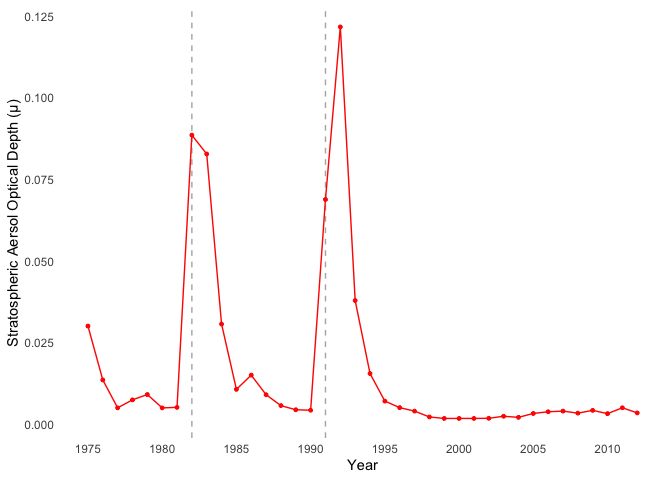
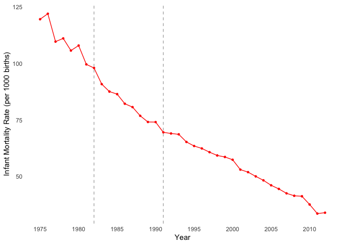
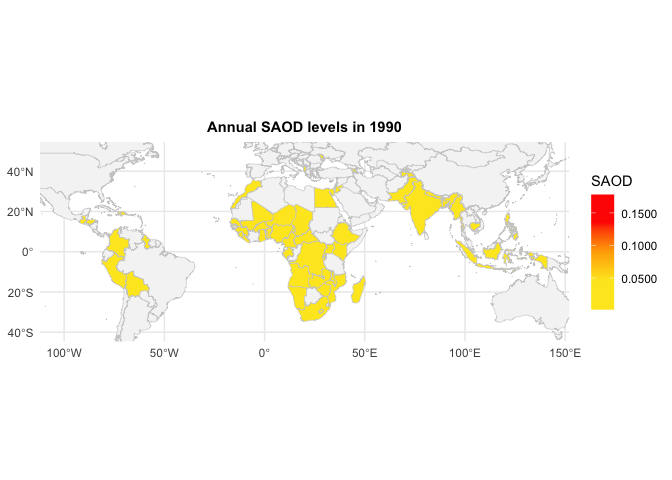
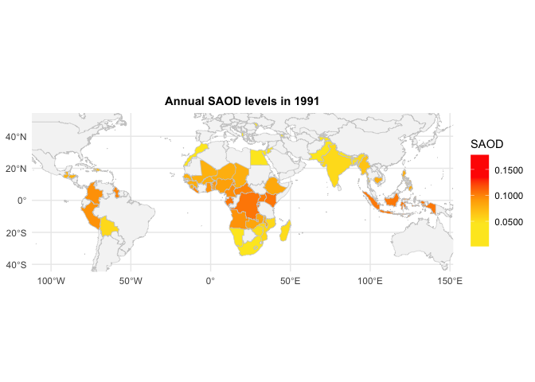
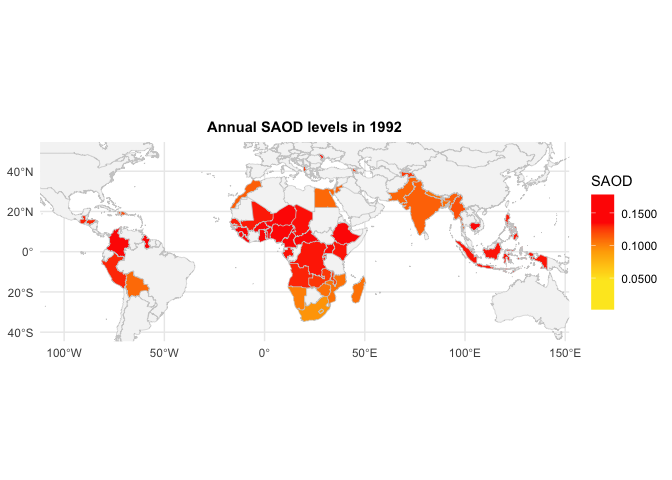
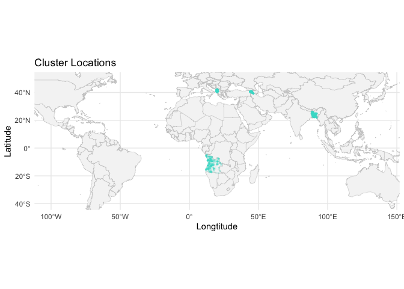
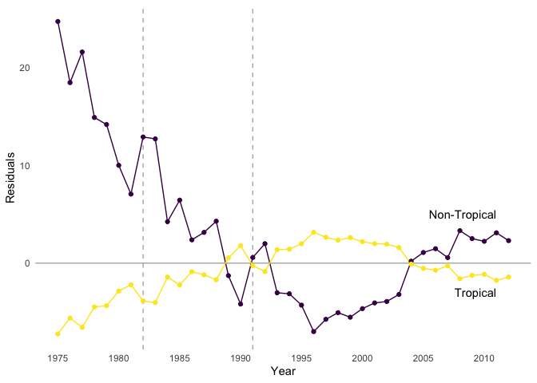

Final Project–Research Methods
================
Abuzar Royesh
3/6/2019

``` r
#Parameters
library(tidyverse)
library(sf)
library(lfe)
library(plm)
# library(SDMTools)
library(modelr)
library(stringr)

# data files ===================================================================
imr_saod_file <- "imr_saod_data.rds"
deaths_file <- "API_SP.DYN.CDRT.IN_DS2_en_excel_v2_10473944.xls"
countries_file <- "ne_50m_admin_0_countries/ne_50m_admin_0_countries.shp"

imr_saod <- read_rds(imr_saod_file)

saod_values <- 
  c(
    max(imr_saod$saod), 
    quantile(imr_saod$saod, probs = 0.9), 
    median(imr_saod$saod), 
    quantile(imr_saod$saod, probs = 0.1), 
    min(imr_saod$saod)
  )

saod_colors <- c("#fde724", "#fde724", "#ffac00", "#ff2700", "#ff2700")
```

Here, I am looking at the impact of sulfate aerosol optical depth levels
(SAOD) and infant mortality rate in select countries. Volcanic eruptions
release these particles into the air, which reflect sunlight. In my
dataset, I have 2.1 million observations for infant mortality for
100,000+ clusters for 1975 to 2012. I have paired them with SAOD levels
for the same location and year. During this period there were two
notable volcanic eruptions that greatly increased SAOD levels: El
Chichón (Mexico) in 1982 and Mount Pinatubo (Philippines) in 1992.

This is what the data looks like.

``` r
imr_saod
```

    ## # A tibble: 2,168,028 x 9
    ##    country cluster_id cluster_lat cluster_lon child_birth_year   IMR     n
    ##    <chr>   <chr>            <dbl>       <dbl>            <dbl> <dbl> <int>
    ##  1 Albania AL2008_1          40.8        19.8             1987     0     1
    ##  2 Albania AL2008_1          40.8        19.8             1988     0     1
    ##  3 Albania AL2008_1          40.8        19.8             1989     0     3
    ##  4 Albania AL2008_1          40.8        19.8             1990     0     1
    ##  5 Albania AL2008_1          40.8        19.8             1991     0     2
    ##  6 Albania AL2008_1          40.8        19.8             1993   500     2
    ##  7 Albania AL2008_1          40.8        19.8             1994     0     4
    ##  8 Albania AL2008_1          40.8        19.8             1995     0     3
    ##  9 Albania AL2008_1          40.8        19.8             1996     0     3
    ## 10 Albania AL2008_1          40.8        19.8             1997     0     1
    ## # … with 2,168,018 more rows, and 2 more variables: tropical <chr>, saod <dbl>

\#Initial plots

``` r
#Mean saod over the years
imr_saod %>% 
  group_by(child_birth_year) %>% 
  summarize(saod = mean(saod, na.rm = TRUE)) %>% 
  ggplot(aes(child_birth_year, saod)) + 
  geom_vline(xintercept = c(1982, 1991), linetype = "dashed", color = "gray70") + 
  geom_line(color = "#ff2700") + 
  geom_point(color = "#ff2700", size = 1) +
  scale_x_continuous(breaks = seq(1975, 2012, 5), minor_breaks = NULL) + 
  theme_minimal() + 
  theme(
    panel.grid =  element_blank() 
  ) + 
  labs(
    x = "Year", 
    y = "Stratospheric Aersol Optical Depth (μ)"
  )
```

    ## `summarise()` ungrouping output (override with `.groups` argument)

<!-- -->

``` r
#Mean IMR over the years
imr_saod %>% 
  group_by(child_birth_year) %>% 
  summarize(imr = mean(IMR, na.rm = TRUE)) %>% 
  ggplot(aes(child_birth_year, imr)) + 
  geom_vline(xintercept = c(1982, 1991), linetype = "dashed", color = "gray70") + 
  geom_line(color = "#ff2700") + 
  geom_point(color = "#ff2700", size = 1) +
  scale_x_continuous(breaks = seq(1975, 2012, 5), minor_breaks = NULL) + 
  theme_minimal() + 
  theme(
    panel.grid =  element_blank() 
  ) + 
  labs(
    x = "Year", 
    y = "Infant Mortality Rate (per 1000 births)"
  )
```

    ## `summarise()` ungrouping output (override with `.groups` argument)

<!-- -->

\#\#\#Plotting SAOD levels

Here, I am plotting the SAOD levels before and after the volcanic
eruption in Mount Pinatubo (1992).

``` r
saod_year <- function(year) {
  imr_saod %>% 
  # filter(child_birth_year >= 1990, child_birth_year <= 1992) %>% 
  group_by(country, child_birth_year) %>% 
  summarize(saod = mean(saod, na.rm = TRUE)) %>% 
  filter(child_birth_year == year) 
}

world <- 
  read_sf(countries_file) %>% 
  select(SOVEREIGNT)

world_plot <- function(year) {
  world %>% 
    left_join(saod_year(year), by = c("SOVEREIGNT" = "country")) %>% 
    ggplot() + 
    geom_sf(aes(fill = saod), color = "gray80", size = 0.2) + 
    scale_fill_gradientn(
      name = "SAOD",
      colors = c("#fde724", "#fde724", "#ffac00", "#ff2700", "#ff2700"),
      limits = c(0.0017, 0.178),
      labels = scales::number_format(scale = , accuracy = 0.0001),
      na.value = "gray96"
    ) +
    coord_sf(
      ylim = c(-40, 50), 
      xlim = c(-100, 140)
    ) + 
    theme_minimal() + 
    labs(title = str_glue("Annual SAOD levels in {year}")) + 
    theme(plot.title = element_text(face = "bold", hjust = 0.5, size = rel(1)))
}

c(1990:1993) %>% #list the years for which I want maps 
  map(world_plot)
```

    ## `summarise()` regrouping output by 'country' (override with `.groups` argument)
    ## `summarise()` regrouping output by 'country' (override with `.groups` argument)
    ## `summarise()` regrouping output by 'country' (override with `.groups` argument)
    ## `summarise()` regrouping output by 'country' (override with `.groups` argument)

    ## [[1]]

<!-- -->

    ## 
    ## [[2]]

<!-- -->

    ## 
    ## [[3]]

<!-- -->

    ## 
    ## [[4]]

<!-- -->

``` r
cluster_locations <- 
  imr_saod %>% 
  distinct(country, cluster_lat, cluster_lon) %>% 
  st_as_sf(coords = c("cluster_lon", "cluster_lat"), crs = 4326)

cluster_locations %>% 
  slice(1:3000) %>% #REMOVE THIS LINE FOR FULL ANALYSIS. Otherwise takes too long. 
  ggplot() + 
  geom_sf(data = world, color = "gray80", fill = "gray96", size = 0.2) + 
  geom_sf(size = 1/3, color = "turquoise", shape = 21, alpha = 0.1) + 
  coord_sf(
    ylim = c(-40, 50), 
    xlim = c(-100, 140)
  ) + 
  theme_minimal() + 
  labs(
    title = "Cluster Locations",
    x = "Longtitude", 
    y = "Latitude"
  )
```

<!-- -->

\#\#\#No SAOD residuals

Here I am plotting mean residuals from our a cluster and time fixed
effects model when not accounting for SAOD. I am disaggregating my data
by tropical and
non-tropical.

``` r
no_saod_fit <- felm(IMR ~ 1 | child_birth_year + cluster_id, data = imr_saod)

imr_saod$no_saod_resid <- summary(no_saod_fit)$residuals

imr_saod %>% 
  group_by(child_birth_year, tropical) %>% 
  summarize(resid = mean(no_saod_resid, na.rm = TRUE)) %>% 
  ggplot(aes(child_birth_year, resid, color = tropical)) + 
  geom_vline(xintercept = c(1982, 1991), linetype = "dashed", color = "gray70") + 
  geom_hline(yintercept = 0, color = "gray70") +
  geom_line() + 
  geom_point() + 
  scale_x_continuous(breaks = seq(1975, 2012, 5)) + 
  scale_color_viridis_d(breaks = NULL) +
  theme_minimal() + 
  theme_minimal() + 
  theme(
    panel.grid =  element_blank() 
  ) + 
  labs(
    x = "Year", 
    y = "Residuals"
  ) + 
  annotate(
    geom = "text", 
    x = 2011, 
    y = c(-3, 5), 
    label = c("Tropical", "Non-Tropical"), 
    hjust = "right"
  )
```

    ## `summarise()` regrouping output by 'child_birth_year' (override with `.groups` argument)

<!-- -->

\#\#\#cluster and time fixed effects for tropical and non-tropical
regions

``` r
fit_tropical <- 
  felm(
    IMR ~ saod | child_birth_year + cluster_id, 
    data = imr_saod %>% filter(tropical == "Yes"), 
    weights = imr_saod %>% filter(tropical == "Yes") %>% pull(n)
  )

fit_nontropical <- 
  felm(
    IMR ~ saod | child_birth_year + cluster_id, 
    data = imr_saod %>% filter(tropical == "No"), 
    weights = imr_saod %>% filter(tropical == "No") %>% pull(n)
  )

summary(fit_tropical, robust = TRUE)
```

    ## 
    ## Call:
    ##    felm(formula = IMR ~ saod | child_birth_year + cluster_id, data = imr_saod %>%      filter(tropical == "Yes"), weights = imr_saod %>% filter(tropical ==      "Yes") %>% pull(n)) 
    ## 
    ## Weighted Residuals:
    ##      Min       1Q   Median       3Q      Max 
    ## -1032.09  -117.50   -56.04    -2.68  1922.93 
    ## 
    ## Coefficients:
    ##      Estimate Robust s.e t value Pr(>|t|)
    ## saod    23.91      21.79   1.097    0.273
    ## 
    ## Residual standard error: 251 on 1428475 degrees of freedom
    ## Multiple R-squared(full model): 0.1198   Adjusted R-squared: 0.07457 
    ## Multiple R-squared(proj model): 1.137e-06   Adjusted R-squared: -0.05133 
    ## F-statistic(full model, *iid*): 2.65 on 73328 and 1428475 DF, p-value: < 2.2e-16 
    ## F-statistic(proj model): 1.204 on 1 and 1428475 DF, p-value: 0.2726

``` r
summary(fit_nontropical, robust = TRUE)
```

    ## 
    ## Call:
    ##    felm(formula = IMR ~ saod | child_birth_year + cluster_id, data = imr_saod %>%      filter(tropical == "No"), weights = imr_saod %>% filter(tropical ==      "No") %>% pull(n)) 
    ## 
    ## Weighted Residuals:
    ##     Min      1Q  Median      3Q     Max 
    ## -750.28 -100.19  -45.52    0.22 1804.49 
    ## 
    ## Coefficients:
    ##      Estimate Robust s.e t value Pr(>|t|)    
    ## saod   438.00      67.51   6.488 8.73e-11 ***
    ## ---
    ## Signif. codes:  0 '***' 0.001 '**' 0.01 '*' 0.05 '.' 0.1 ' ' 1
    ## 
    ## Residual standard error: 232 on 632762 degrees of freedom
    ## Multiple R-squared(full model): 0.1057   Adjusted R-squared: 0.05843 
    ## Multiple R-squared(proj model): 9.727e-05   Adjusted R-squared: -0.05278 
    ## F-statistic(full model, *iid*):2.236 on 33461 and 632762 DF, p-value: < 2.2e-16 
    ## F-statistic(proj model): 42.09 on 1 and 632762 DF, p-value: 8.732e-11

\#\#\#Adding death rates to the models

I am adding death rates to partially account for the impact of wars,
famine, diseases, etc.

``` r
deaths <- 
  readxl::read_excel(deaths_file, skip = 3) %>% 
  select(-c(`Country Code`, `Indicator Name`, `Indicator Code`)) %>% 
  gather(key = year, value = death_rate, -`Country Name`) %>% 
  mutate(year = as.integer(year)) %>% 
  arrange(`Country Name`, year) %>% 
  mutate(
    country = case_when(
      `Country Name` == "Congo, Dem. Rep." ~ "Democratic Republic of the Congo", 
      `Country Name` == "Egypt, Arab Rep." ~ "Egypt",
      `Country Name` == "Eswatini" ~ "Swaziland",
      `Country Name` == "Timor-Leste" ~ "Timor", 
      TRUE ~ `Country Name`
    )
  ) %>% 
  select(-`Country Name`)
```

Running the models here:

``` r
imr_saod_add <- 
  imr_saod %>% 
  left_join(deaths, by = c("country", "child_birth_year" = "year")) %>% 
  arrange(cluster_id)

fit2_tropical <- 
  felm(
    IMR ~ saod + death_rate | child_birth_year + cluster_id, 
    data = imr_saod_add %>% filter(tropical == "Yes"), 
    weights = imr_saod_add %>% filter(tropical == "Yes") %>% pull(n)
  )

fit2_nontropical <- 
  felm(
    IMR ~ saod + death_rate | child_birth_year + cluster_id, 
    data = imr_saod_add %>% filter(tropical == "No"), 
    weights = imr_saod_add %>% filter(tropical == "No") %>% pull(n)
  )

summary(fit2_tropical, robust = TRUE)
```

    ## 
    ## Call:
    ##    felm(formula = IMR ~ saod + death_rate | child_birth_year + cluster_id,      data = imr_saod_add %>% filter(tropical == "Yes"), weights = imr_saod_add %>%          filter(tropical == "Yes") %>% pull(n)) 
    ## 
    ## Weighted Residuals:
    ##      Min       1Q   Median       3Q      Max 
    ## -1030.04  -117.57   -55.59    -2.33  1918.88 
    ## 
    ## Coefficients:
    ##             Estimate Robust s.e t value Pr(>|t|)    
    ## saod       -24.91764   21.87929  -1.139    0.255    
    ## death_rate   1.76868    0.06801  26.007   <2e-16 ***
    ## ---
    ## Signif. codes:  0 '***' 0.001 '**' 0.01 '*' 0.05 '.' 0.1 ' ' 1
    ## 
    ## Residual standard error: 250.9 on 1428474 degrees of freedom
    ## Multiple R-squared(full model): 0.1203   Adjusted R-squared: 0.07519 
    ## Multiple R-squared(proj model): 0.0006644   Adjusted R-squared: -0.05064 
    ## F-statistic(full model, *iid*):2.665 on 73329 and 1428474 DF, p-value: < 2.2e-16 
    ## F-statistic(proj model): 339.1 on 2 and 1428474 DF, p-value: < 2.2e-16

``` r
summary(fit2_nontropical, robust = TRUE)
```

    ## 
    ## Call:
    ##    felm(formula = IMR ~ saod + death_rate | child_birth_year + cluster_id,      data = imr_saod_add %>% filter(tropical == "No"), weights = imr_saod_add %>%          filter(tropical == "No") %>% pull(n)) 
    ## 
    ## Weighted Residuals:
    ##     Min      1Q  Median      3Q     Max 
    ## -731.99  -99.93  -44.97    0.24 1798.98 
    ## 
    ## Coefficients:
    ##            Estimate Robust s.e t value Pr(>|t|)    
    ## saod       278.9084    67.5598   4.128 3.65e-05 ***
    ## death_rate   6.2339     0.2303  27.064  < 2e-16 ***
    ## ---
    ## Signif. codes:  0 '***' 0.001 '**' 0.01 '*' 0.05 '.' 0.1 ' ' 1
    ## 
    ## Residual standard error: 231.8 on 632761 degrees of freedom
    ## Multiple R-squared(full model): 0.107   Adjusted R-squared: 0.05975 
    ## Multiple R-squared(proj model): 0.001496   Adjusted R-squared: -0.05131 
    ## F-statistic(full model, *iid*):2.265 on 33462 and 632761 DF, p-value: < 2.2e-16 
    ## F-statistic(proj model):   384 on 2 and 632761 DF, p-value: < 2.2e-16

In non-tropical clusters, we find that SAOD levels were a significant
predictor of infant mortality.
